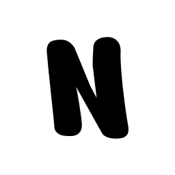

<p align="center">
  
</p>

<h1 align="center">Notchly</h1>

<p align="center">
  Turn your MacBook notch into a useful, interactive space.
</p>

<p align="center">
  <a href="https://notchly.xyz"><strong>Website</strong></a>
  ·
  <a href="https://github.com/Notchly/Notchly/releases/latest"><strong>Download for macOS</strong></a>
  ·
  <a href="https://cdn.notchly.xyz/notchly-preview.mp4"><strong>Video preview</strong></a>
  ·
  <a href="docs/ARCHITECTURE.md"><strong>Architecture</strong></a>
</p>

<p align="center">
  
  
  
  <a href="https://github.com/Notchly/Notchly/releases/latest">
    
  </a>
  <a href="https://github.com/Notchly/Notchly/blob/main/LICENSE">
    
  </a>
  <a href="https://github.com/Notchly/Notchly/stargazers">
    
  </a>
  <a href="https://github.com/Notchly/Notchly/releases">
    
  </a>
</p>

---

## Notchly

**Notchly** is a lightweight native macOS app that gives the MacBook notch something useful to do.

It adds compact HUDs, live music controls, lock screen support, focus animations, swipe gestures, smooth transitions, and small native interactions around the notch, making it feel like an intentional part of macOS instead of unused screen space.

Notchly is built to stay simple, fast, and focused.

## Preview

<p align="center">

https://github.com/user-attachments/assets/01e1a07d-79c5-444c-abfd-1ae2ec9b4e48

</p>

## Features

| Feature | What it adds |
| --- | --- |
| Dynamic Island overlay | A compact, native HUD designed for the notch and safe area. |
| Music controls | Play/pause, previous/next, seek, shuffle, volume, artwork, and app handoff. |
| Lock screen player | A centered music player with liquid-glass styling and artwork transitions. |
| Battery states | Charging, low-battery, and compact battery status views. |
| Focus animations | Short on/off animations that work alongside active music playback. |
| Swipe gestures | Quick controls for switching and interacting with island states. |
| Multi-display support | Choose primary-display behavior or let Notchly follow the active screen. |
| Native settings | Focused preferences for general behavior, battery, music, and updates. |

## Quickstart

### Download

1. Open the [latest release](https://github.com/Notchly/Notchly/releases/latest).
2. Download the `Notchly-*.dmg` asset.
3. Open the DMG and move Notchly to Applications.
4. Launch Notchly from Applications.

Depending on your macOS security settings, you may need to confirm the first launch in System Settings. macOS may also ask for Automation permission the first time you use Spotify or Apple Music controls that rely on Apple Events.

### Settings

Open Notchly from the menu bar to configure:

- General behavior, launch at login, lock sound, and focus animations
- Battery visibility and low-battery threshold
- Music preview timing and AppleScript controls for Spotify or Apple Music
- Primary-display behavior for multi-monitor setups

## Build From Source

### Requirements

- macOS 15.6 or newer
- Xcode 26 or newer
- A Mac display setup where notch or safe-area behavior is available

### Xcode

1. Clone the repository.
2. Open `Notchly.xcodeproj`.
3. Let Xcode resolve Swift Package Manager dependencies.
4. Select the `Notchly` scheme.
5. Build and run.

### Command Line

```sh
git clone git@github.com:Notchly/Notchly.git
cd Notchly
xcodebuild -project Notchly.xcodeproj -scheme Notchly -configuration Debug build
```

For a build with a custom DerivedData directory:

```sh
xcodebuild \
  -project Notchly.xcodeproj \
  -scheme Notchly \
  -configuration Debug \
  -derivedDataPath /tmp/notchly-derived \
  build
```

## Dependencies

Notchly uses Swift Package Manager through the Xcode project:

- [Sparkle](https://sparkle-project.org/) for app update checks
- [SkyLightWindow](https://github.com/Lakr233/SkyLightWindow) for overlay window integration
- [mediaremote-adapter](https://github.com/ejbills/mediaremote-adapter) for Now Playing / MediaRemote access

## Project Structure

- `Config`: app configuration files, including Sparkle-backed `Info.plist`
- `Notchly/App`: app lifecycle, dependency container, menu bar, overlay, focus, and lock-screen coordinators
- `Notchly/Managers`: observable runtime state for settings, music, battery, and island module selection
- `Notchly/Models`: small domain models shared across managers and views
- `Notchly/Views`: SwiftUI views grouped by island, settings, and shared UI
- `Notchly/Windows`: AppKit wrappers for standalone windows
- `Notchly/Helpers`: platform helpers and SwiftUI/AppKit bridges
- `Notchly/Resources`: assets, sounds, and bundled adapter resources
- `docs`: architecture notes and project documentation

See [docs/ARCHITECTURE.md](docs/ARCHITECTURE.md) for the runtime flow and ownership map.

## Contributing

Pull requests are welcome. Please keep platform integrations isolated, avoid committing local signing changes, and make sure the app builds before opening a PR.

See [CONTRIBUTING.md](CONTRIBUTING.md) for local setup and the PR checklist.

## License

Notchly is released under the MIT License. See [LICENSE](LICENSE) for details.
