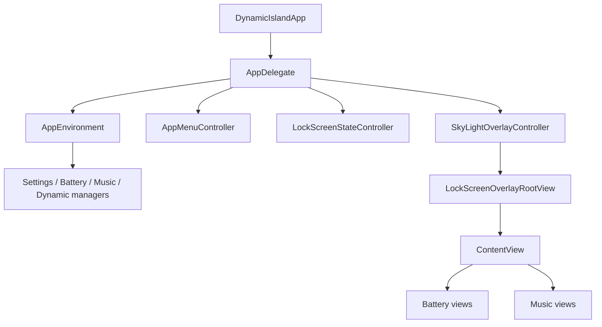

# Architecture

Notchly is a SwiftUI-first macOS app with a small AppKit shell. The main architectural goal is to keep platform lifecycle concerns out of feature views.

## Runtime Flow

## App Layer

`AppDelegate` is intentionally thin. It owns startup and shutdown only.

`AppEnvironment` creates long-lived dependencies:

- `SettingsManager`
- `MusicManager`
- `BatteryManager`
- `DynamicManager`
- `SettingsWindow`
- Sparkle updater controller
- lock-screen overlay model

`AppMenuController` owns the menu bar item and commands.

`LockScreenStateController` owns distributed lock/unlock notifications and the short polling loop needed to stabilize screen state.

`SkyLightOverlayController` owns the top-level overlay window integration.

## State Managers

Managers are the observable boundary between system APIs and SwiftUI:

- `SettingsManager` persists user defaults and launch-at-login state.
- `MusicManager` listens to Now Playing state and exposes playback metadata/control.
- `BatteryManager` reads power source information.
- `DynamicManager` decides which island module should be visible.

Views should consume manager state and send user intents back through manager methods or local view actions.

## Views

Island UI is split by feature:

- `Views/Island/Battery`
- `Views/Island/Music`
- `Views/Island/Logic`
- `Views/Shared`

`ContentView` is the island state machine. Feature views should stay mostly presentational.

Settings UI lives under `Views/Settings` and is shown through `SettingsWindow`.

## Distribution Notes

The app currently uses the private `MediaRemote` framework through `mediaremote-adapter`. Keep that dependency isolated and document any changes, because private APIs can affect signing, notarization, and App Store eligibility.
